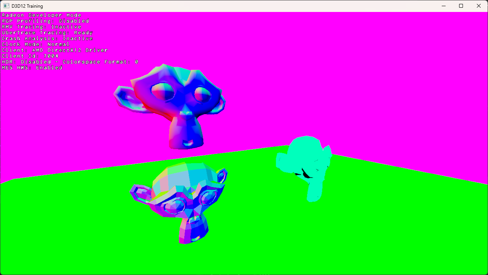
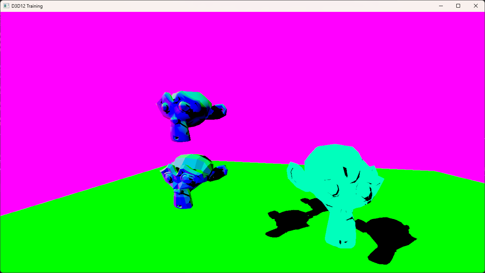

# D3D12 Training
This is a 3D rendered made in DirectX 12 that I use as a training sandbox for learning DirectX 12.  

This renderer uses DXR.
## Prerequisites
- Windows 10 up to date or Windows 11
- Visual Studio 2022
- DXR compatible graphics card, up to Shader Model 6.3, feature level 12.2 (DirectX 12 Ultimate)
## Features
- Basic graphic pipeline
- Basic Ray Tracing pipeline with DXR
- GLTF loader
- Camera control with XInput
- A PowerShell script for easy shader compilation
# Screenshots

# Useful Links
- [DirectX Raytracing Spec](https://microsoft.github.io/DirectX-Specs/d3d/Raytracing.html)
- [DirectX Raytracing Documentation](https://learn.microsoft.com/en-us/windows/win32/direct3d12/direct3d-12-raytracing)
- [Laura's Self Contained DirectX Raytracing Tutorial](https://landelare.github.io/2023/02/18/dxr-tutorial.html)
- NVIDIA : [DX12 Raytracing tutorial](https://developer.nvidia.com/rtx/raytracing/dxr/DX12-Raytracing-tutorial-Part-1) by Martin-Karl Lefrançois and Pascal Gautron
- Will Usher : [The RTX Shader Binding Table Three Ways](https://www.willusher.io/graphics/2019/11/20/the-sbt-three-ways/)
- Test model made with [Blender](https://www.blender.org/)
- [DirectX Shader Compiler](https://github.com/microsoft/DirectXShaderCompiler)
- [Pix on Windows](https://devblogs.microsoft.com/pix/)